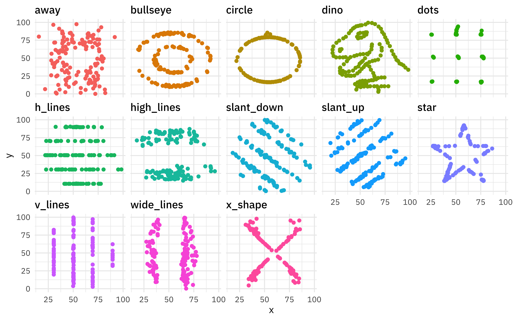

```{r xaringan-themer, include=FALSE, warning=FALSE}
library(xaringanthemer)
style_mono_accent(
  base_color = "#081d58",
  text_bold_color = "#e7298a",
  title_slide_text_color = "#edf8b1",
 # header_font_google = google_font("Josefin Sans"),
  base_font_size = "17px",
  text_font_size = "1rem",
 code_font_size = "1rem",
 #text_font_google   = google_font("Montserrat", "300", "300i")
  code_font_google   = google_font("Fira Mono")
)
```


```{r setup, include=FALSE}
library(knitr)
options(htmltools.dir.version = FALSE)
#read_chunk("src/main.R")
library(patchwork)
library(grid)
library(gridExtra)
library(ggrepel)
library(png)
library(ggpubr)
library(RColorBrewer)
library(forecast)
library(rlang)
library(tidyverse)
library(tsfeatures)
library(kableExtra)
library(plotly)
```


class: title-slide, top, left, inverse
background-image: url("img/pinwheels.jpg")
background-size: cover

---
class: title-slide, top, left, inverse
background-image: url("img/pinwheels.jpg")
background-size: cover

<div style="border: 2px solid ##feb24c; padding: 20px; width: 80%; margin: auto; background-color: ##feb24c; font-size: 40px; color: black; font-weight: bold;">
  <p> Whether timber can be successfully used as a material for small wind turbine blades</p>
</div>
---
class: title-slide, top, left, inverse
background-image: url("img/pinwheels.jpg")
background-size: cover

<div style="border: 2px solid ##feb24c; padding: 20px; width: 80%; margin: auto; background-color: ##feb24c; font-size: 40px; color: black; font-weight: bold;">
  <p> Whether timber can be successfully used as a material for small wind turbine blades</p>
</div>

<div style="border: 2px solid ##feb24c; padding: 20px; width: 80%; margin: auto; background-color: #a1d99b; font-size: 40px; color: black; font-weight: bold;">
  <p> Two readily available Australian
grown softwood timber species, radiata pine and hoop pine, were selected. </p>
</div>


---
class: title-slide, top, left, inverse
background-image: url("img/pinwheels.jpg")
background-size: cover

<div style="border: 2px solid ##feb24c; padding: 20px; width: 80%; margin: auto; background-color: ##feb24c; font-size: 40px; color: black; font-weight: bold;">
  <p> Whether timber can be successfully used as a material for small wind turbine blades</p>
</div>

<div style="border: 2px solid ##feb24c; padding: 20px; width: 80%; margin: auto; background-color: black; font-size: 30px; color: white; font-weight: bold;">
  <p> Peterson P, Clausen PD. Timber for high efficiency small wind turbine blades. Wind Engineering. 2004 Jan; 28(1): 87-96. </p>
</div>

---
class: title-slide, top, left, inverse
background-image: url("img/pinwheels.jpg")
background-size: cover

<div style="border: 2px solid ##feb24c; padding: 20px; width: 80%; margin: auto; background-color: ##feb24c; font-size: 40px; color: black; font-weight: bold;">
  <p> Whether timber can be successfully used as a material for small wind turbine blades</p>
</div>

<div style="border: 2px solid ##feb24c; padding: 20px; width: 90%; margin: auto; background-color: #49006a; font-size: 30px; color: white; font-weight: bold;">
  <p> Simulated data set inspired from  Peterson and Clausen (2004)   </p>
</div>
---

.pull-l[

```{r, echo=FALSE, warning=FALSE, message=FALSE, comment=""}
set.seed(42)

# Generate cycle values
cycles <- round(seq(10, 600, length.out = 15) )


slope <- -0.1 
intercept_radiata <- 140  # 
intercept_hoop <- 130  # 
stress_radiata <- round(intercept_radiata + slope * cycles + rnorm(length(cycles), 0, 2)) 

stress_hoop <- round(intercept_hoop + slope * cycles + rnorm(length(cycles), 0, 4))
stress_hoop[1] <- 143
stress_hoop[2] <- 133
stress_hoop[15] <- 85

data_radiata <- data.frame(Cycle = cycles, Stress_MPa = stress_radiata, Species = "Radiata Pine")
data_hoop <- data.frame(Cycle = cycles, Stress_MPa = stress_hoop, Species = "Hoop Pine")

# Combine the datasets
final_data <- bind_rows(data_radiata, data_hoop)

# Display the final data frame
final_data

```


]

.pull-r[


]

---
.pull-l[

```{r, echo=FALSE, comment=NA}
final_data
```

]

.pull-r[


# What patterns or insights can you identify from the data? 
]

---
.pull-l[

```{r, echo=FALSE, comment=NA}
final_data
```

]

.pull-r[


# What patterns or insights can you identify from the data? 

```{r, echo=FALSE}
final_data |> 
  group_by(Species)|>
  summarise(round(mean(Stress_MPa),2)) |>
  knitr::kable(col.names = c("Species", "Mean Stress (MPa)")) |>
  kable_styling(font_size = 30)
```


]

---

.pull-l[

```{r, echo=FALSE, comment=NA}
final_data
```

]

.pull-r[


# What patterns or insights can you identify from the data? 

```{r, echo=FALSE}
final_data |> 
  group_by(Species)|>
  summarise(round(mean(Stress_MPa),2),
            round(sd(Stress_MPa),2),) |>
  knitr::kable(col.names = c("Species", "Mean of Maximum Stress (MPa)", "Standard Deviation (MPa)")) |>
  kable_styling(font_size = 30)
```
]

---

.pull-l[

```{r, echo=FALSE, comment=NA}
final_data
```

]

.pull-r[


```{r, echo=FALSE, fig.height=6, fig.width=7, warning=FALSE, message=FALSE}
final_data |> 
  group_by(Species)|>
  summarise(round(mean(Stress_MPa),2),
            round(sd(Stress_MPa),2),) |>
  knitr::kable(col.names = c("Species", "Mean of Maximum Stress (MPa)", "Standard Deviation (MPa)")) |>
  kable_styling(font_size = 20)

p1 <- ggplot(final_data, aes(x = Species, y = Stress_MPa, col = Species)) +
  geom_point(size=3) +
  stat_summary(fun = mean, geom = "point", color = "black", size = 4, shape=2) +  
 # stat_summary(fun = mean, geom = "text", aes(label = round(..y.., 2)), 
#               color = "black", vjust = -1, size = 5) +  
  labs(x = "Species", y = "Maximum Stress (MPa)", col = "Species") +  
ggtitle("Individual Value Plot of Stress by Species") +
  scale_color_brewer(palette = "Dark2")
ggplotly(p1)
```
]

---

.pull-l[

```{r, echo=FALSE, comment=NA}
final_data
```

]

.pull-r[


```{r, echo=FALSE, fig.height=7, fig.width=10, warning=FALSE, message=FALSE}
p2 <- ggplot(final_data, aes(x=Cycle, y=Stress_MPa, col=Species)) + geom_point() +   scale_color_brewer(palette = "Dark2") + ggtitle("Scatterplot of Maximum Stress (MPa) vs Number of Cycles") + labs(x="Number of Cycles", y="Maximum Stress (MPa)")
ggplotly(p2)
```
]

---


.pull-l[

```{r, echo=FALSE, comment=NA}
final_data
```

]

.pull-r[


```{r, echo=FALSE, fig.height=7, fig.width=10, warning=FALSE, message=FALSE}
p2 <- ggplot(final_data, aes(x=Cycle, y=Stress_MPa, col=Species)) + geom_point() +   scale_color_brewer(palette = "Dark2") + ggtitle("Scatterplot of Maximum Stress (MPa) vs Number of Cycles") + labs(x="Number of Cycles", y="Maximum Stress (MPa)")
ggplotly(p2)
```

```{r, echo=FALSE}
final_data |> 
  group_by(Species)|> 
  summarise(round(cor(Cycle, Stress_MPa), 2)) |>
    knitr::kable(col.names = c("Species", "Pearson correlation coefficient")) |>
  kable_styling(font_size = 20)
```

]

---

# Pearson Correlation Coefficient (r)

- Measures the **strength and direction** of a **linear** relationship between two continuous variables.

- Its value ranges from -1 to 1.

```{r, echo=FALSE, fig.width=15, fig.height=3}
set.seed(1228)
# Generate data
set.seed(42)
x <- seq(-10, 10, length.out = 100)
y_perfect_pos <- x
y_perfect_neg <- -x
y_no_corr <- x^2
y_moderate_pos <- 0.5 * x + rnorm(100, 0, 3)
y_moderate_neg <- -0.5 * x + rnorm(100, 0, 3)

no <- data.frame(x=rnorm(100), y=rnorm(100)) 

# Create plots for different correlations
p0 <- ggplot(no, aes(x, y)) + 
  geom_point() + ggtitle("r = 0\nNo Relationship") +
  labs(y="Y", x="X")+
  theme(aspect.ratio = 1) 


p1 <- ggplot(data.frame(x, y_perfect_pos), aes(x, y_perfect_pos)) + 
  geom_point() + ggtitle("r = 1\n Perfect Positive\nLinear Relationship)") +
  labs(y="Y", x="X")+
  theme(aspect.ratio = 1) 

p2 <- ggplot(data.frame(x, y_perfect_neg), aes(x, y_perfect_neg)) + 
  geom_point() + ggtitle("r = -1\nPerfect Negative\nLinear Relationship)") +labs(y="Y", x="X")+
  theme(aspect.ratio = 1) 

p3 <- ggplot(data.frame(x, y_no_corr), aes(x, y_no_corr)) + 
  geom_point() + ggtitle("r = 0\nNo Linear Relationship") + labs(y="Y", x="X")+
  theme(aspect.ratio = 1) 

p4 <- ggplot(data.frame(x, y_moderate_pos), aes(x, y_moderate_pos)) + 
  geom_point() + ggtitle("0 < r < 1\nModerate Positive\nLinear Relationship") +labs(y="Y", x="X")+
  theme(aspect.ratio = 1) 

p5 <- ggplot(data.frame(x, y_moderate_neg), aes(x, y_moderate_neg)) + 
  geom_point() + ggtitle("-1 < r < 0\nModerate Negative\nLinear Relationship") +labs(y="Y", x="X")+
  theme(aspect.ratio = 1) 

# Arrange the plots in a grid
grid.arrange(p2, p5, p0, p3, p4, p1, ncol = 6)

```

---
class: inverse

## Your turn

.pull-l[

- 13 data sets


]

---
class: inverse

## Your turn

.pull-l[

- 13 data sets

- Each of the 13 datasets contains X and Y variables 


]

---
class: inverse

# Your turn

.pull-l[

- 13 data sets

- Each of the 13 datasets contains X and Y variables. 

- The corresponding scatterplots are shown below here: 👉

]

.pull-r[

```{r, echo=FALSE, fig.height=15, fig.width=15}

```

]

---
class: inverse

# Your turn

.pull-l[

- 13 data sets

- Each of the 13 datasets contains X and Y variables. 

- The corresponding scatterplots are shown below here: 👉

## Which dataset has the highest correlation coefficient?

]

.pull-r[

```{r, echo=FALSE, fig.height=15, fig.width=15}

```

]

---

.pull-left[

```{r, echo=FALSE, fig.height=15, fig.width=15}

```


]


.pull-right[


]

---

.pull-left[

```{r, echo=FALSE, fig.height=15, fig.width=15}

```


]


.pull-right[


]

## Do not believe summary statistics on their own. 

## Always visualize your data for a complete understanding

---
class: inverse, center, middle

# Branches of Statistics

---
class: title-slide, top, left, inverse
background-image: url("img/pop1.png")
background-size: cover

---
class: title-slide, top, left, inverse
background-image: url("img/pop2.png")
background-size: cover

---
class: title-slide, top, left, inverse
background-image: url("img/pop3.png")
background-size: cover

---
class: inverse, center, middle

# Hypothesis testing

---
class: title-slide, top, left, inverse
background-image: url("img/hy1.png")
background-size: cover

---
class: title-slide, top, left, inverse
background-image: url("img/hy2.png")
background-size: cover

---
class: title-slide, top, left, inverse
background-image: url("img/hy3.png")
background-size: cover

---
class: title-slide, top, left, inverse
background-image: url("img/electricity.jpg")
background-size: contain


## Electricity Demand Forecasting for Grama Niladhari Divisions	(14,018) in Sri Lanka


---

## Number of series: 1

```{r, echo=FALSE, message=FALSE, warning=FALSE, comment=NA}
library(tidyverse)
library(coronavirus)
coronavirus <- coronavirus %>% mutate(cases = replace(cases, which(cases<0), 20))
coronavirus <- coronavirus %>% mutate(cases = replace(cases, which(cases>800000), 800))
#confirmed <- coronavirus %>% filter(type == "confirmed")
confirmed <- coronavirus %>% 
  filter(type == "confirmed") %>%
  group_by(country, date) %>%
  summarise(cases = sum(cases)) 
```

```{r, echo=FALSE, fig.width=15, fig.height=8, warning=FALSE, message=FALSE}
library(plotly)
p <- ggplot(confirmed, aes(x=date, y=cases)) + geom_line(colour=NA) +  theme(legend.position = "none")
p + geom_line(data = subset(confirmed,  country == "Norway"),color = "red") + theme(legend.position = "none") + ylim(c(0, 800)) + ylab("MW")
```

---
## Number of series: 2

```{r, echo=FALSE, fig.width=15, fig.height=8, warning=FALSE, message=FALSE}
library(plotly)
p <- ggplot(confirmed, aes(x=date, y=cases)) + geom_line(colour=NA) +  theme(legend.position = "none")
p + geom_line(data = subset(confirmed,  country == "Norway"),color = "red") + geom_line(data = subset(confirmed,  country == "China"),color = "#7570b3") + theme(legend.position = "none") + ylim(c(0, 800)) + ylab("MW")
```


---

## Number of series: 3

```{r, echo=FALSE, fig.width=15, fig.height=8, warning=FALSE, message=FALSE}
library(plotly)
p <- ggplot(confirmed, aes(x=date, y=cases)) + geom_line(colour=NA) +  theme(legend.position = "none")
p + geom_line(data = subset(confirmed,  country == "Norway"),color = "red") + geom_line(data = subset(confirmed,  country == "China"),color = "#7570b3") + geom_line(data = subset(confirmed,  country == "Australia"),color = "#1b9e77") +
  theme(legend.position = "none") + ylim(c(0, 800)) + ylab("MW")
```

---


## Number of series: 10

```{r, echo=FALSE, fig.width=15, fig.height=8, warning=FALSE, message=FALSE}
library(plotly)
p <- ggplot(confirmed, aes(x=date, y=cases)) + geom_line(colour=NA) +  theme(legend.position = "none")
p + geom_line(data = subset(confirmed,  country == "Norway"),color = "red") + geom_line(data = subset(confirmed,  country == "China"),color = "#7570b3") + geom_line(data = subset(confirmed,  country == "Australia"),color = "#1b9e77") +
  geom_line(data = subset(confirmed,  country == "Sri Lanka"),color = "#ff7f00") +
  geom_line(data = subset(confirmed,  country == "Ireland"),color = "#6a3d9a") +
  geom_line(data = subset(confirmed,  country == "Colombia"),color = "#1f78b4") +
  geom_line(data = subset(confirmed,  country == "Russia"),color = "#b2df8a") +
  geom_line(data = subset(confirmed,  country == "Mexico"),color = "#fdbf6f") +
  geom_line(data = subset(confirmed,  country == "Canada"),color = "#fb9a99") +
  geom_line(data = subset(confirmed,  country == "Poland"),color = "#cab2d6") +
  theme(legend.position = "none") + ylim(c(0, 800)) + ylab("MW")
```

---


## Number of series: More than 100

```{r, echo=FALSE, fig.width=15, fig.height=8, warning=FALSE, message=FALSE}
library(plotly)
p <- ggplot(confirmed, aes(x=date, y=cases, colour=country)) + geom_line() +  theme(legend.position = "none")
p + theme(legend.position = "none") + ylim(c(0, 800)) + ylab("MW")
```


---
class: title-slide, top, left, inverse
background-image: url("img/supermarket.jpg")

---
class: title-slide, top, left, inverse
background-image: url("img/ts.jpeg")
background-size: contain

---
class: title-slide, top, left, inverse
background-image: url("img/jhu.png")
background-size: contain

---

# Time Series Features

- Cognostics: Computer-aided diagnostics (John W. Tukey, 1985)

- Characteristics of time series

- Summary measures of time series

---
class: title-slide, top, left
background-image: url("img/mytree.png")
background-size: contain

---
class: title-slide, top, left, inverse
background-image: url("img/tsf4.png")
background-size: contain

---
class: title-slide, top, left, inverse
background-image: url("img/tsf3.png")
background-size: contain

---
class: title-slide, top, left, inverse
background-image: url("img/tsf2.png")
background-size: contain

---

## 10, 826 time series

## 25 features

```{r, echo=FALSE, warning=FALSE, message=FALSE, comment=NA}
library(here)
load(here("data","yearly_features_training.rda"))
  
as_tibble(yearly_features_training)
```

---
class: inverse

# Dimension Reduction Techniques

- Principal component analysis

- t-SNE

- UMAP and many more

---

```{r, echo=FALSE, warning=FALSE, message=FALSE}
calculate_pca <- function(feature_dataset){
  pcaY_cal <- prcomp(feature_dataset, center = TRUE, scale = TRUE)
  PCAresults <- data.frame(PC1 = pcaY_cal$x[, 1], 
                           PC2 = pcaY_cal$x[, 2], 
                           PC3 = pcaY_cal$x[, 3])
  return(list(prcomp_out =pcaY_cal,pca_components = PCAresults))
}

pca_projection <- function(prcomp_out, data_to_project){
  
  PCA <- scale(data_to_project, prcomp_out$center, prcomp_out$scale) %*% prcomp_out$rotation
  pca_projected <- data.frame(PC1=PCA[,1], PC2=PCA[,2], PC3=PCA[,3]) 
  return(pca_projected)
  
}

# yearly
load("data/features_M4Y.rda")
load("data/yearly_features_training.rda") ## M1 and M3 data only
## Construct PCA space from simulated, M1 and M3 and then project M4-competition data
pca_ref_calc <- calculate_pca(yearly_features_training)
# vars_transformed <- apply(pca_ref_calc$prcomp_out$x, 2, var)
# vars_transformed/sum(vars_transformed)
ref_pca <- pca_ref_calc$pca_components
## Project M4 yearly data
M4Y_PCA <- pca_projection(pca_ref_calc$prcomp_out, features_M4Y)
## draw PCA plot
pca_all_yearly <- bind_rows(ref_pca, M4Y_PCA,  .id="source")
pca_all_yearly$data <- c(rep("M1", 181),rep("M3",645),rep("Simulated", 10000), rep("M4", 23000))
pca_all_yearly_ref <- pca_all_yearly %>% filter(!data == "M4")

yearly_features_training2 <- bind_rows(features_M4Y, yearly_features_training)
pca_ref_calc_yearly <- calculate_pca(yearly_features_training2)
pca_ref_calc_yearly <- data.frame(pca_ref_calc_yearly$pca_components)
minx <- min(pca_ref_calc_yearly$PC1)
maxx <- max(pca_ref_calc_yearly$PC1)
miny <- min(pca_ref_calc_yearly$PC2)
maxy <- max(pca_ref_calc_yearly$PC2)


```

```{r, echo=FALSE, warning=FALSE, message=FALSE}
ggplot(pca_all_yearly, aes(x=PC1, y=PC2)) +   
  geom_point(size=4) +xlab("PCA Component 1")+ylab("PCA Component 2")+
  theme(legend.title = element_blank()) +theme(aspect.ratio = 1, legend.position = "none")+
  ggtitle("PCA projection") 
```

---


```{r, echo=FALSE, warning=FALSE, message=FALSE}
ggplot(pca_all_yearly, aes(x=PC1, y=PC2)) +   
  geom_point(alpha=0.5, size=4) +xlab("PCA Component 1")+ylab("PCA Component 2")+
  theme(legend.title = element_blank()) +theme(aspect.ratio = 1, legend.position = "none")+
  ggtitle("PCA projection") 
```

---

```{r, echo=FALSE, warning=FALSE, message=FALSE}
ggplot(pca_all_yearly, aes(x=PC1, y=PC2)) +   
  geom_point(size=4, alpha=0.5) +
  geom_density_2d( contour_var = "ndensity", col="#d95f02", lwd=1) +xlab("PCA Component 1")+ylab("PCA Component 2")+
  theme(legend.title = element_blank()) +theme(aspect.ratio = 1, legend.position = "none")+
  ggtitle("PCA projections") 
```

---
class: title-slide, top, left, inverse
background-image: url("img/rice1.png")
background-size: contain

---
class: title-slide, top, left, inverse
background-image: url("img/rice2.png")
background-size: contain

---
class: title-slide, top, left, inverse
background-image: url("img/f1.png")
background-size: contain

---
class: title-slide, top, left, inverse
background-image: url("img/f2.png")
background-size: contain

---
class: title-slide, top, left, inverse
background-image: url("img/f3.png")
background-size: contain

---
class: title-slide, top, left, inverse
background-image: url("img/f4.png")
background-size: contain

---
class: title-slide, top, left, inverse
background-image: url("img/f5.png")
background-size: contain

---
class: title-slide, top, left, inverse
background-image: url("img/f6.png")
background-size: contain

---
class: title-slide, top, left, inverse
background-image: url("img/f7.png")
background-size: contain

---
class: title-slide, top, left, inverse
background-image: url("img/f8.png")
background-size: contain

---
class: title-slide, top, left, inverse
background-image: url("img/f9.png")
background-size: contain

---
class: title-slide, top, left, inverse
background-image: url("img/f10.png")
background-size: contain

---
class: title-slide, top, left, inverse
background-image: url("img/f11.png")
background-size: contain

---
class: title-slide, top, left, inverse
background-image: url("img/f12.png")
background-size: contain

---
class: title-slide, top, left, inverse
background-image: url("img/f13.png")
background-size: contain

---

## Publications


- seer R package: https://github.com/thiyangt/seer

- Talagala, Thiyanga S., Rob J. Hyndman, and George Athanasopoulos. "Meta‐learning how to forecast time series." Journal of Forecasting 42, no. 6 (2023): 1476-1501.

- Talagala, Thiyanga S., Feng Li, and Yanfei Kang. "FFORMPP: Feature-based forecast model performance prediction." International Journal of Forecasting 38, no. 3 (2022): 920-943.

- Montero-Manso, Pablo, George Athanasopoulos, Rob J. Hyndman, and Thiyanga S. Talagala. "FFORMA: Feature-based forecast model averaging." International Journal of Forecasting 36, no. 1 (2020): 86-92.

